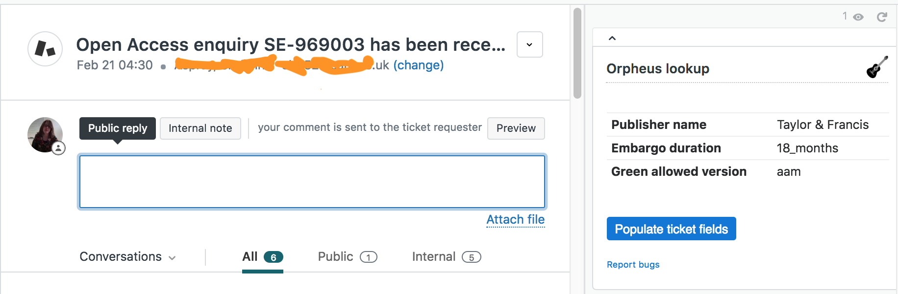

# Orpheus lookup

This application interacts with [Orpheus API](https://orpheus-prod.lib.ds.cam.ac.uk) to populate manuscript submission ticket fields with relevant information from publisher policies.

### The following information is displayed:

* Journal's Article Processing Charges (APC) range
* Embargo duration
* Self-archiving allowed versions
* Green licence
* Gold OA options

Please submit bug reports to [info(at)openaccess.cam.ac.uk](mailto:info@openaccess.cam.ac.uk).

### Screenshot(s):

